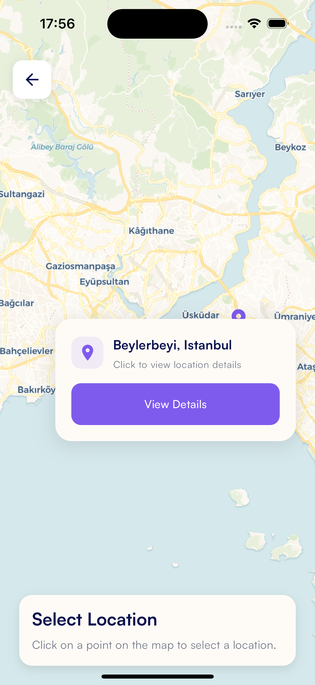
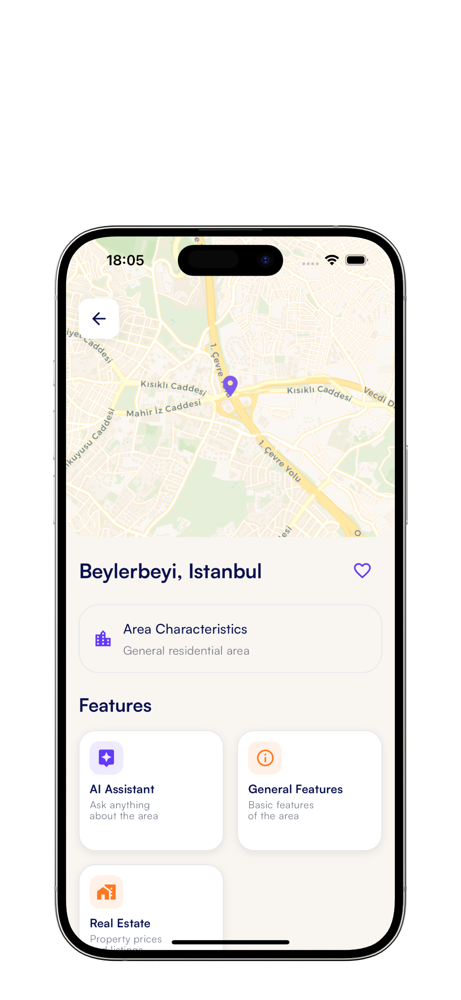
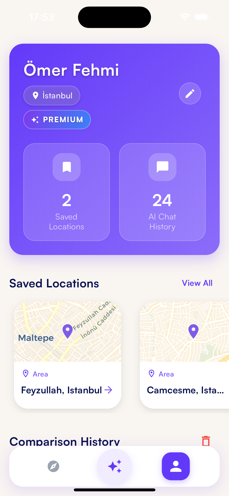

# MOGI - AI-Powered Location Analysis App

<p align="center">
  
</p>

MOGI is an AI-powered location analysis and comparison application leveraging OpenAI's advanced language models. It provides users with detailed information, comparisons, and personalized recommendations about areas they want to move to.

## 📱 App Features

### 🗺️ Location Analysis
- **Detailed Area Reviews**: Comprehensive evaluations in terms of safety, transportation, education, healthcare, and social amenities
- **Map Integration**: Visual exploration and discovery of areas
- **Saving & History**: Save favorite locations and track recently viewed locations

### 🤖 AI Assistant
- **OpenAI (GPT-4o-mini) Integration**: Comprehensive answers to natural language questions via advanced language models
- **Quick Questions**: Fast access to pre-prepared, most frequently asked questions
- **Personalized Recommendations**: Smart suggestions based on user preferences and past interactions
- **Chat History**: Storage and later access to all conversations

### 📊 Location Comparison
- **Multi-Location Comparison**: Compare up to three locations simultaneously
- **Comparison History**: Save completed comparisons for future reference
- **Detailed Analysis Reports**: Analysis of strengths and weaknesses of compared locations
- **AI-Powered Evaluation**: Comprehensive comparison results generated with artificial intelligence

### 💎 Premium Features
- **Mogi Points**: Virtual currency that can be used for premium features
- **Subscription Options**: Weekly and monthly premium subscription plans
- **Unlimited Access**: Unlimited AI chat and location comparison for premium users
- **Priority Support**: Fast support exclusive to premium users

## 📸 Screenshots

<p align="center">
  
  
  
</p>

<p align="center">
  
  
  
  
</p>

## 🔧 Technical Specifications

### Environment Variables
The application requires several API keys to function properly. Create a `.env` file in the root directory based on the `.env.example` template with the following variables:

```
GOOGLE_MAPS_API_KEY=your_google_maps_api_key_here
OPENWEATHER_API_KEY=your_openweather_api_key_here
OPENAI_API_KEY=your_openai_api_key_here
API_BASE_URL=your_api_base_url_here
ENCRYPTION_SECRET=your_encryption_secret_here
SUPABASE_URL=your_supabase_url_here
SUPABASE_ANON_KEY=your_supabase_anon_key_here
MAPTILER_API_KEY=your_maptiler_api_key_here
```

⚠️ **Important**: Never commit your actual API keys to version control.

### Technologies Used
- **Frontend**: Flutter/Dart
- **State Management**: Flutter Bloc
- **Local Database**: Hive
- **Backend Integration**: Supabase
- **Maps**: Flutter Map
- **AI**: OpenAI API
- **HTTP Requests**: http
- **Localization**: intl
- **Secure Storage**: flutter_secure_storage

### Architecture
- **Clean Architecture**: Domain, data, and presentation layers
- **Repository Pattern**: Abstraction between data sources and business logic
- **Service-Oriented**: Separate service classes for each feature
- **Dependency Injection**: Using get_it for dependency injection

## ⚙️ Setup and Running

### Requirements
- Flutter SDK 3.21.0 or higher
- Dart SDK 3.3.1 or higher
- OpenAI API Key
- Supabase Account and API Keys

### Installation Steps

1. Clone the repo:
```bash
git clone https://github.com/omerfehmii/MOGI.git
cd MOGI
```

2. Install dependencies:
```bash
flutter pub get
```

3. Create a `.env` file and add the necessary API keys:
```
GOOGLE_MAPS_API_KEY=your_google_maps_api_key_here
OPENWEATHER_API_KEY=your_openweather_api_key_here
OPENAI_API_KEY=your_openai_api_key_here
API_BASE_URL=your_api_base_url_here
ENCRYPTION_SECRET=your_encryption_secret_here
SUPABASE_URL=your_supabase_url_here
SUPABASE_ANON_KEY=your_supabase_anon_key_here
MAPTILER_API_KEY=your_maptiler_api_key_here
```

4. Run the app:
```bash
flutter run
```

## 🛠️ Development

### Project Structure
```
lib/
├── core/                  # Core structures and services
│   ├── constants/         # Constant values
│   ├── di/                # Dependency injection
│   ├── errors/            # Error classes
│   ├── network/           # Network operations
│   ├── services/          # Basic services
│   ├── theme/             # Theme definitions
│   ├── utils/             # Helper functions
│   └── widgets/           # Common widgets
├── features/              # App features
│   ├── ai_assistant/      # AI Assistant feature
│   ├── auth/              # Authentication
│   ├── chat/              # Chat operations
│   ├── location_analysis/ # Location analysis
│   └── profile/           # User profile
└── main.dart              # App entry point
```

### Adding Features
1. Create a new directory under the `features` directory
2. Add data, domain, and presentation layers
3. Add necessary models, services, and UI components
4. Integrate into the main application

## 📝 License
This project is licensed under the MIT license. See the [LICENSE](LICENSE) file for details.

## 👨‍💻 Developer
Developed by an individual developer.

## 📌 Contact
For questions or feedback: [omerfehmicakici@gmail.com](mailto:omerfehmicakici@gmail.com)
